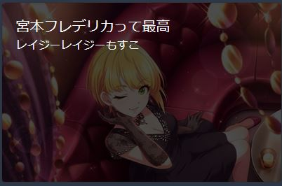

# ブログ記事用リポジトリ
## `site.json`について
```
{
  "title": "タイトル",
  "subtitle": "サブタイトル",
  "cardStyle": "default" | "overlay(image必須)",
  "image": "ヘッダーまたはオーバーレイの背景画像"
  "permalink": "パーマリンク",
  "content": "Markdownのパス",
  "tags": [
    "タグ配列"
  ],
  "hidden": true 記事を隠すかどうか（Devビルドでは無視されます）
},
```

### 例
```
{
  "title": "宮本フレデリカって最高",
  "subtitle": "レイジーレイジーもすこ",
  "style": "overlay",
  "image": "https://cdn.img-conv.gamerch.com/img.gamerch.com/imascg-slstage-wiki/1535116859.jpg"
  "permalink": "imas/frederica-suko",
  "content": "imas/frederica.md",
  "tags": [
    "フレデリカ",
    "アイドルマスター"
  ]
},
```

### 表示

